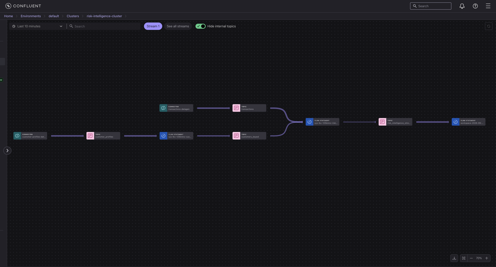

# Real-Time Risk Intelligence Platform

A real-time financial risk and fraud detection system built on Confluent Cloud. It enriches high-frequency transaction streams with live customer risk scores using Flink SQL temporal table joins.

## Problem & Business Impact

Traditional fraud detection relies on batch processing or static lookup tables, which creates latency where fraudulent transactions slip through before risk scores update. Conversely, overly strict static rules lead to false positives, unfairly declining legitimate customer purchases.

This platform solves both problems by processing transactions and customer risk updates as continuous, real-time data streams:
- **Instant Fraud Prevention:** Evaluates high-value transactions against the latest customer risk score in milliseconds, flagging high-risk events before chargebacks occur.
- **Improved Customer Experience:** Eliminates unnecessary transaction blocks for low-risk customers by keeping risk profiles dynamically updated.
- **Operational Efficiency:** Provides risk ops teams with an automated, real-time risk stream rather than delayed daily reports.

---

## Architecture & Lineage



```
customer-profiles-datagen ──> customer_profiles topic ──> customers_keyed (table) ──┐
                                                                                     ├──> risk_intelligence_stream
transactions-datagen ────────> transactions topic ──────────────────────────────────┘
```

---

## Data Sources & Schemas

Custom Avro schemas ingested via Datagen Source Connectors:

* **`customer_profiles`**: `customer_id` (string), `segment` (retail/premium/business), `risk_score` (int: 0–100)
* **`transactions`**: `transaction_id` (string), `customer_id` (string), `merchant` (string), `amount` (double)

---

## Stream Processing (Flink SQL)

### 1. Keyed Customer Profile Materialized Table
```sql
CREATE MATERIALIZED TABLE customers_keyed (
  customer_id STRING NOT NULL,
  segment STRING,
  risk_score INT,
  PRIMARY KEY (customer_id) NOT ENFORCED
) AS
SELECT COALESCE(customer_id, '') AS customer_id, segment, risk_score
FROM customer_profiles;
```

### 2. Real-Time Risk Scoring Stream
Enriches transactions in real time via a temporal join (`FOR SYSTEM_TIME AS OF`) and flags risk:
- `risk_score > 70` AND `amount > 1000` -> **HIGH_RISK**
- `risk_score > 70` -> **WATCH**
- Otherwise -> **NORMAL**

```sql
CREATE MATERIALIZED TABLE risk_intelligence_stream AS
SELECT
  t.transaction_id, t.customer_id, c.segment, c.risk_score,
  t.merchant, t.amount,
  CASE
    WHEN c.risk_score > 70 AND t.amount > 1000 THEN 'HIGH_RISK'
    WHEN c.risk_score > 70 THEN 'WATCH'
    ELSE 'NORMAL'
  END AS risk_flag
FROM transactions t
JOIN customers_keyed FOR SYSTEM_TIME AS OF t.`$rowtime` AS c
  ON t.customer_id = c.customer_id;
```

---

## Stream Governance
- **Schema Registry:** Avro format with BACKWARD compatibility across all 4 schemas (`customer_profiles`, `transactions`, `customers_keyed`, `risk_intelligence_stream`).
- **Stream Lineage:** End-to-end visual tracing across connectors, topics, and Flink statements.

---

## Confluent Cloud Screenshots

| Stage | Description | Screenshot Link |
| :--- | :--- | :--- |
| **Clusters** | Clusters home view | [`1-clusters-home.png`](./screenshots/1-clusters-home.png) |
| **Cluster Overview** | Cluster metrics & endpoints | [`2-risk-intelligence-cluster.png`](./screenshots/2-risk-intelligence-cluster.png) |
| **Connectors** | Running Datagen source connectors | [`3-connectors.png`](./screenshots/3-connectors.png) |
| **Schema Registry** | Schema Registry overview | [`4-schema-registry.png`](./screenshots/4-schema-registry.png) |
| **Schemas** | Customer profiles Avro schema | [`5-customer-profiles-schema.png`](./screenshots/5-customer_profiles-value-schema.png) |
| **Schemas** | Transactions Avro schema | [`6-transactions-value-schema.png`](./screenshots/6-transactions-value-schema.png) |
| **Flink Environment** | Flink workspace home | [`7-flink-home.png`](./screenshots/7-flink-home.png) |
| **Flink Compute** | AWS region compute pool | [`8-AWS.us-east-2.png`](./screenshots/8-AWS.us-east-2.env-g25vwr.908d.png) |
| **SQL Workspace** | Flink SQL workspace | [`9-SQL-workspace.png`](./screenshots/9-SQL-workspace.png) |
| **Output Stream** | Real-time output data | [`10-risk_intelligence_table-data.png`](./screenshots/10-risk_intelligence_table-data.png) |
| **Stream Lineage** | Full pipeline lineage | [`11-stream-lineage-full.png`](./screenshots/11-stream-lineage-full.png) |
| **Stream Lineage** | Ingestion lineage view | [`12a-stream-lineage-first-half.png`](./screenshots/12a-stream-lineage-first-half.png) |
| **Stream Lineage** | Processing lineage view | [`12b-stream-lineage-second-half.png`](./screenshots/12b-stream-lineage-second-half.png) |
